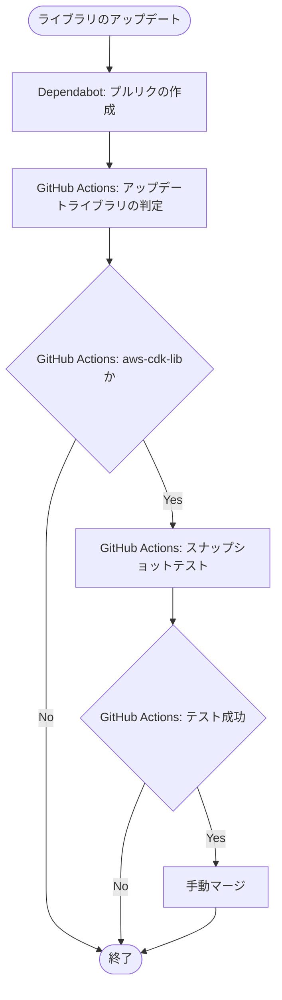

cdk のアップデートのみ対象とするように修正

```mermaid
flowchart TD
  start([ライブラリのアップデート])
  dep-pull-req[Dependabot: プルリクの作成]
  gha-check-library[GitHub Actions: アップデートライブラリの判定]
  is-aws-cdk-lib{GitHub Actions: aws-cdk-libか}
  gha-cdk-test[GitHub Actions: スナップショットテスト]
  is-test-ok{GitHub Actions: テスト成功}
  hum-merge[手動マージ]
  stop([終了])

  start --> dep-pull-req
  dep-pull-req --> gha-check-library
  gha-check-library --> is-aws-cdk-lib
  is-aws-cdk-lib -- Yes --> gha-cdk-test
  is-aws-cdk-lib -- No --> stop
  gha-cdk-test --> is-test-ok
  is-test-ok -- Yes --> hum-merge
  is-test-ok -- No --> stop
  hum-merge --> stop
```
